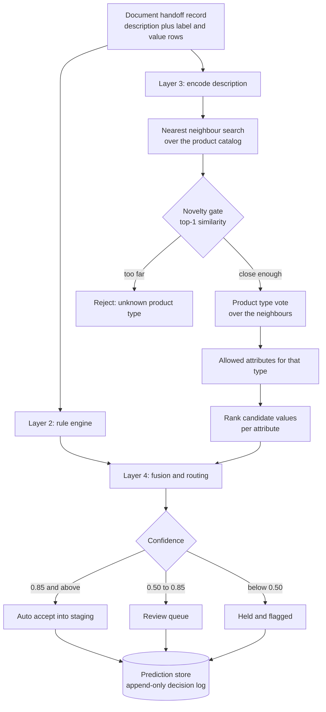

# Attribute prediction from supplier documents: architecture and decisions

A write-up of a production machine learning service I worked on during a
graduate capstone. A distributor receives product datasheets from suppliers and
a person reads each one and types the product's attributes into a catalog
system by hand. The service predicts those attributes, attaches a confidence
score to every prediction, and decides which rows a person still needs to see.

The client, their data and their internal specification are not described here.
Scale figures are approximate and the design is what matters.

## Contents

- [The problem](#the-problem)
- [How the system works](#how-the-system-works)
- [The machine learning in detail](#the-machine-learning-in-detail)
- [Architecture decisions](#architecture-decisions)
- [What the measurements say](#what-the-measurements-say)
- [Failure modes and edge cases](#failure-modes-and-edge-cases)
- [Scope: what is in and what is out](#scope-what-is-in-and-what-is-out)
- [Engineering practice](#engineering-practice)
- [What I would do next](#what-i-would-do-next)

## The problem

The catalog holds a few hundred thousand products, several hundred product
types, and several hundred attribute names. A product type allows only a small
subset of those attributes, usually a handful.

Three properties of the problem shaped every decision that follows.

1. **The label space is large and moves.** New attribute values appear
   constantly, so a fixed classifier over today's values is stale on arrival.
2. **The training text and the production text are different.** The catalog's
   own product descriptions often state the answers almost word for word.
   Supplier datasheets use the supplier's language.
3. **A wrong value that looks confident is worse than no value.** The output
   feeds a catalog that other systems read. The cost of a silent error is much
   higher than the cost of sending a row to a person.

## How the system works



**Input.** The document processing service sends one record per document: a
source type, the raw text, the extracted label and value pairs, normalized
units, reference condition units, and a source reference. The prediction
service never opens a PDF.

**Layer 2, rules.** Exact part number match, fuzzy manufacturer match, and
numeric matching against known values. Rules are precise and explainable, and
silent when the supplier's wording does not resemble the catalog's.

**Layer 3, retrieval and statistics.** A sentence encoder maps the product
description to a vector. An approximate nearest neighbour index returns the
closest catalog products. Those neighbours vote on the product type. For each
attribute the product type allows, candidate values are ranked by a distance
that accounts for how tightly that value's examples cluster.

**Layer 4, fusion and routing.** The rule score and the semantic score combine
into one confidence per row, which decides auto accept, review, or hold. Every
row carries reason codes and the neighbours that supported it.

**Persistence.** Predictions, reviewer decisions and queue state are stored.
The decision log is append-only. Staging is gated on a submission being fully
reviewed.

## The machine learning in detail

### Representation

A pretrained sentence encoder (BAAI bge-small-en-v1.5) maps each product
description to a 384 dimensional vector. Vectors are L2 normalized, so an inner
product is a cosine similarity. It runs on CPU in batches.

The model is used off the shelf. Nothing is fine-tuned. A fine-tuning scaffold
exists in the codebase but is not wired into the service, because fine-tuning
needs labelled pairs the project does not have yet, and because any change to
the encoder invalidates both the index and every value statistic built from it.
That rebuild is the expensive step, so it is not something to do casually.

The encoder revision is pinned. An unpinned model would quietly change the
embeddings and leave the stored artifacts describing vectors that no longer
exist.

### Retrieval

Catalog embeddings live in a FAISS IVFFlat index: an inverted file with 512
Voronoi cells, trained on a sample of the catalog, searching 16 cells per query
and returning the 50 nearest products under an inner product metric.

Exact search would be accurate and unnecessary. The vote only needs the
neighbourhood, not a perfectly ordered list, and the approximate index keeps a
query in the low milliseconds on a CPU. Encoding the catalog is the slow part
of a rebuild, on the order of an hour and a half of CPU time. Building the
index from those vectors takes seconds.

### Product type

The 50 neighbours vote. The confidence is simply the winning type's share of
the ballot. Above 0.80 is treated as high consensus, below 0.60 as ambiguous,
which caps the downstream confidence at 0.75.

The novelty gate is separate and deliberately measures something else: the
similarity of the single closest product. Vote share and similarity answer
different questions, and only the second one can tell you the catalog has never
seen anything like this.

### Value scoring

Every combination of product type, attribute and value becomes a cluster of the
embeddings of the products that use it. Each cluster stores a mean and a
covariance estimated with Ledoit-Wolf shrinkage, which is what makes a
covariance usable when the number of examples is close to the number of
dimensions.

A candidate value scores as

```
score = exp(-D^2 / (2 * sigma^2))
```

where `D^2` is the squared Mahalanobis distance from the query vector to that
cluster, and `sigma` is a per product type temperature chosen by grid search on
the validation split. Mahalanobis rather than Euclidean because a value whose
examples are tightly grouped should punish a distant query harder than a value
whose examples are spread out.

Clusters with fewer than five members do not get an inverse covariance at all.
They fall back to squared Euclidean distance and their confidence is capped.

### The scale mismatch between those two branches

This is the most interesting measurement in the project.

Inverting a 384 by 384 covariance estimated from 8 to 28 points produces `D^2`
in the thousands, while the identity branch is bounded near 0 to 4. On one
product type the median was about 10,653 against 0.40, a factor of roughly
26,600. After the exponential, every low sample cluster scores near 1.0 and
every well estimated one scores near 0.0. The ranking is then decided by
whether a cluster has fewer than five members, not by how similar anything is.
Shrinkage does not close a gap that size at this ratio of samples to
dimensions.

Measured on held-out products, over 2,766 graded answers:

| Candidate pool | n | Mahalanobis | Euclidean |
| --- | --- | --- | --- |
| All clusters the same kind | 1,627 | 76.8% | 53.8% |
| Mixed kinds | 1,139 | 11.7% | 32.4% |

Mahalanobis is much stronger on a uniform pool and collapses on a mixed one.
Since ranking only ever happens within one attribute, the fix is to choose per
attribute: Mahalanobis when that attribute's candidates are all the same kind,
identity when the pool is mixed. That policy is implemented and selectable, and
the default is left on the original behaviour so existing runs reproduce
exactly. Changing a default is a decision for a release, not a side effect of
learning something.

### Rules

Three tiers, tried in order. An exact part number match is terminal and skips
the rest. A fuzzy manufacturer match uses a token set ratio with a minimum
score, which tolerates word order and extra words. Numeric matching compares
quantities and units. A guardrail rejects values that are not permitted for the
attribute in question.

Rules are not machine learning and that is the point. They are exact,
explainable, and correct when they fire.

### Combining the two

```
confidence = alpha * rule_score + (1 - alpha) * semantic_score
```

with alpha at 0.7, divided by the weight actually applied when one of the two
signals does not exist. Routing thresholds sit on top of that number and are
policy, not model output.

### Evaluation protocol

- The split is at the product level, stratified by product type, 80/10/10 with
  a fixed seed. Splitting at row level would put one product's rows on both
  sides and leak the description the encoder sees at evaluation time.
- Product types with fewer than three products go entirely to training, since
  they cannot supply both a validation and a test example.
- Each query product is excluded from its own neighbour list, otherwise the
  system retrieves itself and the metric measures memorization.
- Reported: top-1 and top-3 accuracy, expected calibration error, Brier score,
  and a threshold sweep of coverage against precision. The sweep is what makes
  the auto accept threshold a decision with numbers behind it instead of a
  guess.

## Architecture decisions

### 1. Retrieval and statistics, not a trained classifier

**Options.** Fine-tune a classifier over attribute values. Train per-attribute
models. Retrieve similar catalog products and reuse their values.

**Choice.** Retrieval, with per-value statistics on top.

**Why.** The value vocabulary changes weekly. A classifier would need
retraining to learn a value that retrieval picks up as soon as one example
exists in the catalog. Retrieval also gives the reviewer something a classifier
cannot: the specific catalog products that supported the answer.

**Trade-off.** Accuracy is bounded by how well the catalog's own text separates
the classes, and the index has to be rebuilt when the catalog changes
substantially.

### 2. Predict the product type first, then its attributes

**Choice.** One product type decision gates everything downstream.

**Why.** It turns a several hundred way problem into a handful for each row,
and the type is the easiest thing to get right from a product description. The
type prediction is the most accurate part of the system, so the cheap decision
carries the expensive one.

**Trade-off.** A wrong product type poisons every attribute under it. That is
the single highest leverage failure, which is why it gets its own confidence
bands and its own rejection path.

### 3. Return three candidates, not one

**Choice.** Each attribute returns a ranked top three.

**Why.** The consumer is a person clearing a queue. Picking from a short list
is much faster than typing into an empty box, and the measured gap between the
first guess and the top three is large. Optimizing for a single answer would
have been optimizing the wrong metric.

### 4. Two confidence signals, and a fusion rule that survives a missing one

**Choice.** Combine the rule signal and the semantic signal with a fixed
weighting, and divide by the weight actually applied when only one signal
exists.

**Why.** The original formula assumed both signals were always present. Rules
only fire for part numbers, manufacturers and a few clear cases, so most rows
had no rule signal at all. Their one real signal was multiplied by the smaller
weight, which capped them below every routing threshold. Those rows could not
be auto accepted and could not even reach the review queue.

Normalizing by the applied weight left two-signal rows untouched and moved
single-signal rows onto the same scale.

**Trade-off.** This changes a value the client's contract had frozen, so it
ships behind a config flag that reproduces the old behaviour exactly. The
before and after were measured in the same run to keep the comparison honest.

### 5. A novelty gate on similarity, not on vote share

**Choice.** Refuse to predict when the single closest catalog product is not
similar enough, independent of how strongly the neighbours agree.

**Why.** Vote share cannot detect a product the catalog has never seen. It
measures agreement among the neighbours, and neighbours agree happily even when
all of them are poor matches. Out-of-catalog text produced high vote shares
while its nearest neighbour similarity stayed low, and held-out catalog
products sat well above that line, so the two populations separate cleanly on
similarity.

**Trade-off.** The gate refuses a small fraction of genuine catalog products.
That is the right direction to be wrong in, and the threshold is configurable.

### 6. Confidence is a score, not a probability

**Choice.** Report calibration error alongside accuracy, and describe the
number as a confidence score until real reviewer decisions exist to calibrate
against.

**Why.** Thresholds at 0.85 and 0.50 invite everyone to read the number as
"85% likely correct". It is not that yet. Calibrating it needs labelled
decisions from the people who will use it, which is a dependency to state
plainly rather than paper over.

### 7. Honest evaluation: exclude each product from its own vote

**Choice.** During evaluation, a product is removed from its own neighbour
list.

**Why.** Products sit in the index that the evaluation queries. Without
exclusion, every query retrieves itself as its own nearest neighbour and the
reported accuracy measures memorization. The corrected numbers are lower than
the earlier ones, and they are the numbers that carry forward.

### 8. Idempotent delivery keyed by the caller's key

**Choice.** The caller sends an idempotency key. The first call computes and
stores the response, retries return the stored one.

**Why.** The upstream service retries on transient errors. Without idempotency
a retry would create a second prediction and a second queue item for the same
document. Storing the response also makes retries cheap instead of re-running
the whole pipeline.

### 9. Learning from reviewers is deliberate, not automatic

**Options.** Update the value statistics online as corrections arrive, or fold
corrections into a new model version on demand.

**Choice.** Online updates are off by default. Retraining is a command someone
runs, and it never promotes its own output.

**Why.** Reproducibility was a client requirement. If predictions drift as
corrections arrive, two identical documents get different answers on different
days and no version number explains why. A reviewer's correction still takes
effect immediately as an exact-match rule, which is the fast path that matters,
without moving the statistical model underneath it.

**Trade-off.** Improvements land slower, and someone has to run the retrain and
approve the promotion.

### 10. A model registry with an approval gate and a rollback

**Choice.** Versions are registered with their metrics and a manifest. A
promotion compares against the active version's headline metrics with a
tolerance, requires a named approver, and is recorded. Rollback restores the
previous pointer.

**Why.** "Newer" is not "better". The gate makes a regression an explicit
decision rather than an accident, and the record answers what was live on a
given date.

### 11. CPU only, pinned encoder revision, model baked into the image

**Choice.** No GPU at inference. The encoder is pinned to an exact revision and
copied into the container, which runs with network access to the model hub
disabled.

**Why.** Latency is already a few milliseconds per document on a CPU, so a GPU
would add cost and deployment complexity for nothing. The index and the value
statistics are only valid for the exact embeddings that built them, so an
unpinned model would silently invalidate them. Baking the model in also means
the container starts the same way in an environment with no outbound network.

### 12. Resolve attribute identifiers per product type

**Choice.** Attribute names are resolved to identifiers in the context of the
predicted product type.

**Why.** The same attribute name can exist under more than one identifier, and
the consumer writes by identifier. Resolving by name alone would have written
the right word to the wrong field.

### 13. Reason codes on every row

**Choice.** Each row carries codes such as no rule match, missing field, low
similarity, ambiguous value, low sample, ambiguous product type, unknown
product type.

**Why.** A confidence number tells a reviewer how much to trust a row, not what
to do about it. The codes also turn queue contents into a diagnosis of where
the system is weak.

An early version reported "ambiguous value" whenever the top two candidates
were close, which fired constantly on rows where both scores were near zero and
the real problem was no evidence at all. Ambiguity is now relative to the
scores involved, and near-zero evidence has its own code.

## What the measurements say

Measured on held-out products the system had not seen, with each product
excluded from its own neighbour vote.

| Measure | Result |
| --- | --- |
| Product type correct | 95.5% |
| Right value ranked first | 60.4% |
| Right value in the top three | 85.1% |
| Calibration error | 0.107 |
| Rows auto accepted at 0.85 | 12.1% |
| Of those, correct | 82.4% |

What these numbers do not say:

- **They are measured on catalog text, not supplier datasheets.** The catalog's
  descriptions are cleaner and closer to the answers than a real datasheet is.
  The honest position is that the production number is unknown until real
  documents are measured.
- **Auto accept is not ready to switch on.** 82.4% is below the bar this should
  clear, which means the threshold sits in the wrong place. Moving it correctly
  needs reviewed decisions, not a guess.

## Failure modes and edge cases

- **A product type the catalog does not contain.** Caught by the novelty gate
  and rejected rather than answered.
- **Two product types with similar descriptions.** Vote share lands between the
  bands, the confidence is capped, and the rows route to review.
- **An attribute value with very few examples.** The covariance estimate is
  unreliable, so those clusters fall back to a simpler distance and their
  confidence is capped.
- **An attribute the document never mentions.** The current system still ranks
  candidates for every attribute the type allows. It should abstain instead.
  This is the clearest remaining gap.
- **Values that are ranges, either-or lists, or carry units.** Scored as text
  today, which is weaker than comparing them as quantities.
- **Product types with only two or three attributes defined.** Even a perfect
  system cannot fill a field the type does not allow. This is a data question
  for the catalog owner, not a modelling one.

## Scope: what is in and what is out

In:

- The prediction service and its HTTP interface, with token auth and idempotent
  delivery
- Product type prediction, value ranking, confidence, routing and rejection
- Prediction store, append-only decision log, review queue, staging gate
- Model registry, promotion gate, rollback, manual retraining
- Evaluation suite and reports, container build, CI gates

Out, and deliberately so:

- **Document parsing.** A separate service extracts text and label and value
  pairs. This service consumes a contract, not a PDF.
- **The reviewer interface.** The queue is an API and a table. Someone still
  has to build the screen.
- **Industry standard taxonomy mapping.** The integration exists and is tested,
  but the mapping file is a third party dependency that had not arrived.
- **Cloud deployment and writeback into the catalog system.** Both were owned
  elsewhere.

Naming what is out matters as much as naming what is in. Most of the risk in
this project sat in the seams between those pieces.

## Engineering practice

- Strict linting, strict type checking, formatting, and a branch coverage floor
  enforced in CI, with the service's tests running on every pull request.
- Contract tests that run the real upstream client against the real service
  container, covering auth failure, malformed input, retries and unknown
  products.
- Configuration in version controlled files, with frozen values marked as such
  and behaviour changes shipped behind flags that reproduce the previous
  behaviour exactly.
- A single import script moved the service into the product repository with its
  history intact, so authorship survived and no documentation, data or model
  artifacts crossed over.

## What I would do next

1. Measure on real supplier datasheets. Every number above is provisional until
   this exists.
2. Teach the system to abstain on attributes the document never mentions.
3. Use the extracted label and value pairs directly, matching labels to
   attributes instead of inferring everything from the description.
4. Score values as quantities, including ranges and units.
5. Calibrate the auto accept threshold against real reviewed decisions, then
   turn auto accept on for the attributes that clear the bar.
