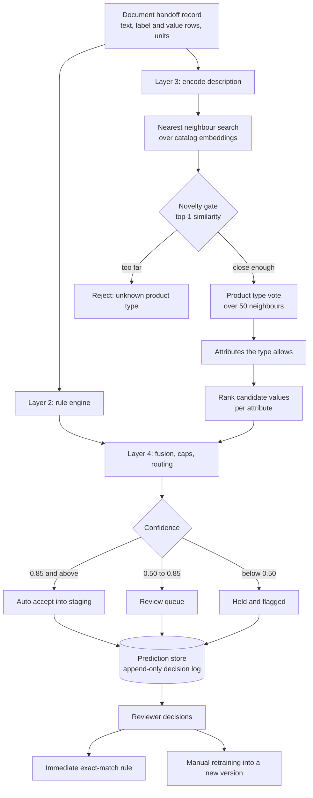

# Attribute prediction from supplier documents

A complete technical write-up of a production machine learning service I
worked on during a graduate capstone.

A distributor receives product datasheets from suppliers. Today a person reads
each one and types the product's attributes into a catalog system by hand. This
service predicts those attributes, attaches a confidence score to every
prediction, and decides which rows a person still needs to see.

The client, their data, their internal specification and their staff are not
described here. Scale figures are approximate. Identifier names that carried
the client's name have been replaced with generic ones.

## How it works, in one picture

## The documents

| Document | What is in it |
| --- | --- |
| [1. Problem and constraints](docs/01-problem-and-constraints.md) | What the system is for, and the three properties of the problem that drove every decision |
| [2. The pipeline](docs/02-pipeline.md) | Layer by layer: input contract, rules, retrieval, scoring, fusion, caps, routing, reason codes, identity |
| [3. Models and math](docs/03-models-and-math.md) | Encoder, index, clusters, distances, calibration, the feedback math, with the formulas |
| [4. Architecture decisions](docs/04-decisions.md) | Twenty decisions as options, choice, reason, trade-off, including the ones that were reversed |
| [5. Service and API](docs/05-service-api.md) | Endpoints, auth, idempotency, error semantics, metrics |
| [6. Persistence and review](docs/06-persistence.md) | Schema, keys, submission states, the staging gate |
| [7. Model lifecycle](docs/07-model-lifecycle.md) | Artifacts, registry, promotion gate, rollback, retraining, the build stages |
| [8. Evaluation](docs/08-evaluation.md) | Protocol, metrics, results, the threshold sweep, two experiments that changed the design |
| [9. Operations](docs/09-operations.md) | Container, configuration, resources, failure handling, runbook |
| [10. Engineering practice](docs/10-engineering-practice.md) | Gates, tests, the repository merge, and mistakes worth recording |
| [11. Gaps and roadmap](docs/11-gaps-and-roadmap.md) | Edge cases, what is deliberately out of scope, what I would do next |

## Headline results

Measured on held-out products, with each product excluded from its own
neighbour vote.

| Measure | Result |
| --- | --- |
| Product type correct | 95.5% |
| Right value ranked first | 60.4% |
| Right value in the top three | 85.1% |
| Expected calibration error | 0.107 |
| Brier score | 0.235 |
| Rows auto accepted at 0.85 | 12.1% |
| Of those, correct | 82.4% |

Two things these numbers do not say. They are measured on catalog text rather
than supplier datasheets, which are messier and further from the answers. And
82.4% is below the bar auto accept should clear, so the threshold is in the
wrong place until real reviewed decisions exist to move it with.

## Shape of the codebase

Roughly 8,600 lines of Python across the service, plus a test suite that holds
branch coverage above 85% in CI.

| Area | Lines |
| --- | --- |
| Layer 3, retrieval and scoring | 1,290 |
| Layer 4, fusion, calibration, feedback, reasons | 1,340 |
| Persistence | 750 |
| Service and schemas | 1,240 |
| Model registry and retraining | 600 |
| Layer 2 rules | 810 |
| Evaluation | 1,110 |
| Data loading and splitting | 260 |
